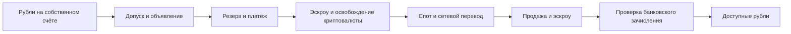
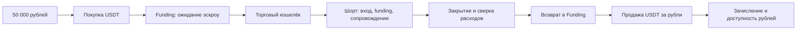

# Реальность прибыли: P2P и шорты

Проверенная исходная версия: `9790f61825b033ce3c579670ca3babb48d04779b`.
Дата исследования: 2026-10-10. Этот документ описывает проверенные пути расчёта,
а не заявляет отсутствие всех уязвимостей проекта или готовность к реальным деньгам.

## Откуда возникает прибыль

P2P приносит результат, когда рубли от продажи оставшегося после обменов USDT/другого
актива превышают себестоимость покупки и все расходы. Видимая разница цен сама по
себе не является доходом: объявления могут исчезнуть, допуск может отсутствовать,
платёж — зависнуть, криптовалюта — остаться на промежуточной площадке.

Шорт USDT-контракта: количество × (цена входа − цена выхода), минус комиссии,
плюс полученное/минус уплаченное финансирование. USDT-результат не равен рублёвому
доходу: нужно учесть покупку USDT, фактическую продажу USDT и доступность рублей.
Полный результат нового цикла = конечные рубли − неоплаченные расходы − 50 000 ₽.
Нереализованная оценка и ожидаемые зачисления не включаются в заработанные рубли.

## Цепочки и доказательства





| Реальный этап | Исходный код | Новая модель / ограничение |
|---|---|---|
| Проверка доступности объявления и KYC | строгие подтверждения либо сценарный допуск | каждый этап содержит тип доказательства; личный допуск неизвестен |
| Оплата покупки | задержка и свежие объявления | банковский платёж записывается отдельно от освобождения эскроу |
| Освобождение эскроу | время | `scenario_delay`, не подтверждённый ордер |
| Спот | свежая глубина, правила пары, комиссии | прежняя модель сохранена; пыль и остатки не исчезают |
| Сетевой перевод | комиссия, открытость сети, задержка | прежняя модель сохранена; не доказательство on-chain зачисления |
| Продажа и рубли | мгновенное виртуальное зачисление при исполнении | новые сценарные круги `receipts-v2`: ожидание зачисления, ограничение счёта, отдельная реализация результата |
| Начальный капитал шортов | 50 000 / наблюдаемый курс | отдельный журнал полного цикла покупает USDT по свежему объявлению; дочерний капитал равен купленной сумме |
| Funding | ограничен выделенными средствами | `exchange-wallet-v2`: сначала свободный кошелёк, затем средства позиции; дефицит учитывается как обязательство и останавливает входы |
| Ликвидация | списание выделенного капитала | остаётся явно обозначенным стрессовым исходом, не точным расчётом биржевого покрытия/страхового фонда |
| Maker | оценка конкурентных объявлений | очередь и явный приход сценарного контрагента; исчезновение конкурента не создаёт продажу |

Новый полный цикл реализован для Bybit, RUB/USDT и СБП собственного T-Банк Black.
Это один независимый 24-часовой торговый период с последующим ожиданием выхода
из всех позиций и продажи USDT. Период может продлиться из-за пропуска данных,
отсутствия ликвидности или невыясненных расходов. После завершения журнал не
перезапускается и не сбрасывается автоматически. На каждой продаже возможны
частичные исполнения; недостаточный для объявления остаток сохраняется.
Внутренние перемещения моделируются отдельно; межбиржевой вывод этот цикл не
подменяет внутренним переводом. Сетевая стоимость применяется в P2P-маршрутах,
где реально присутствует сетевой этап.

## Банк и контрагент

Общие состояния: `available`, `rejected`, `confirmation_required`, `review_115`,
`fraud_161`, `authority_restriction`, `funds_restricted`, `unavailable`.
У ограничений есть причина, дата и источник. Срок пересмотра не снимает ограничение.
Ограниченные деньги остаются активом, но не расходуемыми свободными средствами.
Условный стресс на 1/7/30 дней не является статистикой или вероятностью блокировки.

Нельзя подтвердить оплату флагом «оплачено» или скриншотом. Проверяются владелец
плательщика, получатель, точная сумма, идентификатор банковской операции, спор и
возврат. Неполная/избыточная оплата и третье лицо требуют остановки и сверки.
В модель пока нельзя автоматически импортировать банковскую выписку: валидатор
свидетельств — локальная функция, не банковское подключение. В работающем
сценарии зачисления остаются явно обозначенными допущениями.

После уже завершённого ордера возможен новый спор или ограничение. Автоматического
возврата денег, разблокировки банка и разрешения спора нет. Неизвестные убытки от
мошенничества не объявляются нулевыми или точно равными стоимости ордера.

Открывать новые счета «для обхода блокировок» модель не предлагает. Дополнительные
карты не сбрасывают общие банковские лимиты и не создают деньги. Наличие тарифа
или СБП не подтверждает разрешение регулярной P2P-деятельности.

Пакет сверки: документы происхождения средств, выписки, договорные основания,
реквизиты, объявления с условиями, номера ордеров, исполнения, комиссии и сетевые
транзакции. Фактический состав определяет банк; бот не подделывает документы.

## Покрытие и источники

Машиночитаемая матрица: `docs/execution-matrix.json`; формируется из действующего
каталога и всех зарегистрированных адаптеров. У каждого продукта сохранены
источники/срок тарифов, но личные лимиты, собственность и разрешение P2P неизвестны.
Каталог частичный: отсутствие российского банка в нём — пробел покрытия, а не
отсутствие банка или его ограничений. Кредитный капитал исключён.

| Источник | Проверено | Использование |
|---|---|---|
| [Bybit: P2P fee structure](https://www.bybit.global/en/help-center/article/P2P-on-Bybit-Fees-Explained) | 2026-10-10; публикация обновлена 2026-07-28 | RUB taker 0%; maker buy 0%; maker sell 0,3/0,275/0,25% по уровню |
| [Bybit: funding](https://www.bybit.com/en/help-center/article/Funding-fee-calculation) | 2026-10-10; обновлено 2026-05-12 | свободный кошелёк → маржа, mark для расчёта, динамический интервал; неоднозначность около времени расчёта |
| [Bybit: P2P terms](https://www.bybit.com/common-static/compliance/legal/BYBIT/3fbe62695299e8dbb207575b9898047d.pdf) | 2026-10-10; действует с 2026-01-19 | банк вне эскроу; риски заморозки/возврата; допуск рекламодателя |
| [Т-Банк: документы 115-ФЗ](https://www.tbank.ru/bank/help/general/115-fz-individual/about/documents/) | 2026-10-10 | индивидуальный запрос документов физлица |
| [ЦБ: ограничение переводов из-за базы мошенничества](https://cbr.ru/Reception/TopicalMessage/Page/10927) | исследовано 2026-10-10; личная применимость не подтверждена | не путать с бесплатным порогом СБП 100 000 ₽ |
| [ФНС: цифровая валюта](https://www.nalog.gov.ru/rn01/promo/mining/) | 2026-10-10 | налоговый статус неизвестен; правила криптовалюты не автоматически применимы к деривативам |

Другие площадки: существующие публичные адаптеры продолжают работать, но их
личные комиссии, допуски maker, выводы и статус аккаунта не подтверждены новым
исследованием. Полный рублёвый цикл их не исполняет с нулевыми неизвестными расходами.
Налоговая сумма не рассчитана; во всех новых отчётах результат до налогов.

## Исследование и ограничения защиты

`shortresearch.py` сохраняет последовательное разбиение 60/20/20, датированные
каталоги, реальные записанные стаканы, отсутствие торговли, случайные шорты,
удвоенные комиссии, ухудшенное исполнение и сравнение фильтров. Реплей сохраняет
начальный капитал и версию funding исходного журнала. Неизвестную прошлую
ликвидность нельзя восстановить из свечи или сегодняшнего списка монет.

У новой модели ещё нет независимой накопленной истории. Доходность и пригодность
стратегии не подтверждены. ADL, точный результат ликвидации, индивидуальные
ограничения банка и выплаты страховки не моделируются как подтверждённые исходы.
Mark из минутного ряда при funding — приближение, не расчётная выписка биржи.
Отсутствие наблюдений запрещает заявления об успешной защите в этот промежуток.

## Активация и проверка

Новые переключатели по умолчанию выключены: `PAPER_REALITY=0`, `REALITY_CYCLES=0`.
Первый применяется только к новым сценарным P2P-кругам; строгий и старый журналы
не пересчитываются. Второй включает самостоятельный рублёвый цикл шортов.

После ручной проверки изменений и остановки **supervisor и бота**:

```
python scripts/prepare_reality.py --prepare-model-bot-stopped
```

Скрипт делает SQLite backup всех
журналов, проверяет `quick_check`, сверяет хэши источников и настроек. Ключи не
изменяет и не выводит. Затем создаёт только новый журнал; переключатели и .env
не изменяет. Старые журналы сохраняются. Если данные меняются при копировании,
подготовка завершается ошибкой до создания нового журнала.
Включение `PAPER_REALITY=1` и `REALITY_CYCLES=1` выполняет владелец после ручной
проверки установки; `ALT_SHORTS=1` нужен сборщику. Реальные операции при установке
должны оставаться выключенными. Проверку этого условия выполняют по действующей
процедуре выпуска, без новой правки торговых pin-ов.

После запуска одного экземпляра: `/shorts cycle` показывает 49 901 ₽ после
первого обслуживания; `/shorts cycleexport` выгружает родительский и дочерний
журнал. `/shorts pause` запрещает новые входы обоих журналов, сопровождение и
расчёты выхода продолжаются. `/paper risks` показывает ограничения.

До первой покупки нужны модели стоимости собственных перемещений и входящего
банковского платежа: `data/reality_costs.json` по шаблону
`docs/reality-costs.example.json`. Суммы — строки Decimal, время проверки и
окончания действия — Unix UTC; источник обязателен. Ноль допустим только как
явно введённая ставка с источником, не как замена `null`. Без модели цикл
сохраняет рубли, записывает отказ и не покупает USDT. Повторная подготовка читает
новую модель после резервной копии без сброса капитала. Стоимость здесь задана
за одно перемещение/зачисление, поэтому частичные продажи оплачиваются отдельно.
Личный допуск по-прежнему сценарный; наличие стоимости не подтверждает KYC.

Состояния ограничений доступны также для `Bybit:Funding` и `Bybit:UTA`.
Замороженный торговый кошелёк не исполняет виртуальные входы/выходы по видимым
котировкам; отсутствие исполнения отдельно от отсутствия публичных цен.

Нельзя активировать неподтверждённые защищённые изменения обходом guard. Перед
активацией ещё нужны ручная проверка, проверка единственного процесса и свежих
событий после запуска. Этот документ не утверждает, что активация уже выполнена.
